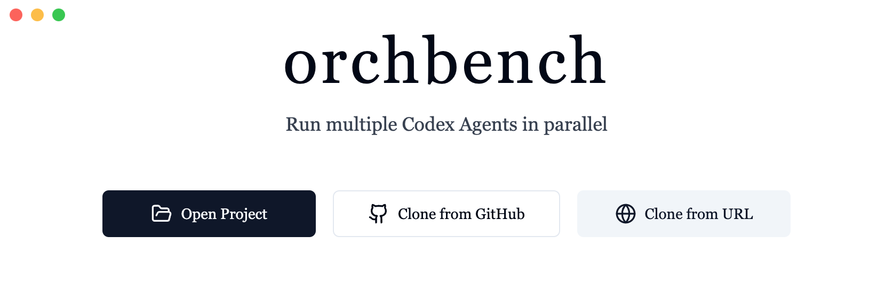

# orcbench

**Agent-agnostic Conductor.build for Codex Agents**

Run multiple Codex Agents in parallel with isolated Git worktrees.



## Requirements

### GitHub CLI
orcbench requires GitHub CLI to be installed and authenticated:

**Install GitHub CLI:**
- **macOS:** `brew install gh`
- **Linux:** `sudo apt install gh` (Ubuntu/Debian) or `sudo dnf install gh` (Fedora)
- **Windows:** `winget install GitHub.cli`

**Authenticate:**
```bash
gh auth login
```

Follow the prompts to authenticate with your GitHub account.

## Getting Started

1. Install GitHub CLI (see Requirements above)
2. Authenticate with GitHub: `gh auth login`
3. Clone this repository
4. Install dependencies: `npm install`
5. Run the app: `npm run dev`

## Data Persistence

orcbench uses SQLite for local data persistence, ensuring your projects and workspaces are maintained across application sessions. All data is stored locally on your machine, providing privacy and offline functionality.

### Database Architecture

The application maintains two primary data structures:

#### Projects Table
Stores information about opened Git repositories and their GitHub integration status:

```sql
CREATE TABLE projects (
  id TEXT PRIMARY KEY,
  name TEXT NOT NULL,
  path TEXT NOT NULL UNIQUE,
  git_remote TEXT,
  git_branch TEXT,
  github_repository TEXT,
  github_connected BOOLEAN DEFAULT 0,
  created_at DATETIME DEFAULT CURRENT_TIMESTAMP,
  updated_at DATETIME DEFAULT CURRENT_TIMESTAMP
);
```

**Key Features:**
- **Unique Path Constraint**: Prevents duplicate project entries
- **Git Integration**: Tracks remote URLs and current branches
- **GitHub Status**: Monitors connection state with GitHub CLI
- **Automatic Timestamps**: Tracks creation and modification times

#### Workspaces Table
Manages isolated agent workspaces with their associated Git worktrees:

```sql
CREATE TABLE workspaces (
  id TEXT PRIMARY KEY,
  project_id TEXT NOT NULL,
  name TEXT NOT NULL,
  branch TEXT NOT NULL,
  path TEXT NOT NULL,
  status TEXT DEFAULT 'idle',
  agent_id TEXT,
  created_at DATETIME DEFAULT CURRENT_TIMESTAMP,
  updated_at DATETIME DEFAULT CURRENT_TIMESTAMP,
  FOREIGN KEY (project_id) REFERENCES projects (id) ON DELETE CASCADE
);
```

**Key Features:**
- **Cascade Deletion**: Removing a project automatically cleans up associated workspaces
- **Status Tracking**: Monitors workspace state (idle, running, completed)
- **Agent Assignment**: Links workspaces to specific agent instances
- **Branch Management**: Tracks Git branch names for each workspace

### Data Location

The SQLite database is automatically created in your system's application data directory:

- **macOS**: `~/Library/Application Support/orcbench/database.sqlite`
- **Windows**: `%APPDATA%/orcbench/database.sqlite`
- **Linux**: `~/.config/orcbench/database.sqlite`

### Database Operations

The application provides a comprehensive set of database operations through the `DatabaseService`:

- **Project Management**: Save, retrieve, and delete project entries
- **Workspace Management**: Create, update, and remove workspace records
- **Automatic Initialization**: Database and tables are created on first launch
- **Error Handling**: Robust error handling with detailed logging

### Privacy & Security

- **Local Storage Only**: All data remains on your local machine
- **No Cloud Sync**: No data is transmitted to external servers
- **GitHub CLI Integration**: Uses official GitHub CLI for secure authentication
- **File System Access**: Only accesses directories you explicitly open

### Performance Considerations

- **Indexed Queries**: Optimized database indexes for fast project and workspace lookups
- **Efficient Storage**: Minimal storage footprint with normalized data structure
- **Background Operations**: Database operations run asynchronously to maintain UI responsiveness

